# User Management System - Use Case Diagram

This document contains the Mermaid use case diagram for the NUSUK User Management System.

## System Roles

| Role | Description |
|------|-------------|
| **ADMIN** | Full system access - manages users, views reports and statistics |
| **SUPERVISOR** | Manages groups, views assigned pilgrims |
| **SUPPORT** | Handles support tickets and user assistance |
| **PILGRIM** | End-user who books trips and manages their profile |
| **USER** | General registered user |

## Use Case Diagram

```mermaid
---
title: NUSUK User Management System - Use Case Diagram
---
flowchart TB
    subgraph Actors["🎭 Actors"]
        Admin((👤 Admin))
        Supervisor((👤 Supervisor))
        Support((👤 Support))
        Pilgrim((👤 Pilgrim))
        User((👤 User))
    end

    subgraph Auth["🔐 Authentication"]
        UC1([Register Account])
        UC2([Login])
        UC3([Logout])
        UC6([Reset Password])
    end

    subgraph Profile["👤 Profile Management"]
        UC4([View Profile])
        UC5([Update Profile])
    end

    subgraph AdminMgmt["⚙️ Admin User Management"]
        UC7([View All Users])
        UC8([Create User])
        UC9([Edit User])
        UC10([Delete User])
        UC11([Block/Activate User])
        UC12([Filter Users by Role])
        UC13([Search Users])
        UC14([View Dashboard Stats])
    end

    subgraph Reports["📊 Reports & Statistics"]
        UC15([View Trip Reports])
        UC16([View General Statistics])
    end

    %% User connections
    User --> UC1 & UC2 & UC3 & UC4 & UC5 & UC6
    Pilgrim --> UC1 & UC2 & UC3 & UC4 & UC5 & UC6
    Supervisor --> UC2 & UC3 & UC4 & UC5 & UC6
    Support --> UC2 & UC3 & UC4 & UC5 & UC6

    %% Admin has full access
    Admin --> UC2 & UC3 & UC4 & UC5 & UC6
    Admin --> UC7 & UC8 & UC9 & UC10 & UC11 & UC12 & UC13 & UC14
    Admin --> UC15 & UC16

    %% Relationships
    UC7 -.->|«include»| UC12
    UC7 -.->|«include»| UC13
    UC9 -.->|«extend»| UC11
```

## Use Cases Description

### 🔐 Authentication Use Cases

| ID | Use Case | Description | Actors |
|----|----------|-------------|--------|
| UC1 | Register Account | Create a new user account in the system | User, Pilgrim |
| UC2 | Login | Authenticate and access the system | All |
| UC3 | Logout | End the current session | All |
| UC6 | Reset Password | Request password reset via OTP | All |

### 👤 Profile Management Use Cases

| ID | Use Case | Description | Actors |
|----|----------|-------------|--------|
| UC4 | View Profile | View personal account information | All |
| UC5 | Update Profile | Modify personal information (name, phone, etc.) | All |

### ⚙️ Admin User Management Use Cases

| ID | Use Case | Description | Actors |
|----|----------|-------------|--------|
| UC7 | View All Users | List all users with pagination | Admin |
| UC8 | Create User | Add a new user with specified role | Admin |
| UC9 | Edit User | Modify user details (name, email, role, etc.) | Admin |
| UC10 | Delete User | Remove a user from the system | Admin |
| UC11 | Block/Activate User | Change user account status | Admin |
| UC12 | Filter Users by Role | Filter user list by role type | Admin |
| UC13 | Search Users | Search users by name or email | Admin |
| UC14 | View Dashboard Stats | View system statistics and counts | Admin |

### 📊 Reports & Statistics Use Cases

| ID | Use Case | Description | Actors |
|----|----------|-------------|--------|
| UC15 | View Trip Reports | View trip status and statistics | Admin |
| UC16 | View General Statistics | View aggregated system statistics | Admin |

## API Endpoints Reference

| Use Case | Method | Endpoint |
|----------|--------|----------|
| Register | POST | `/api/register` |
| Login | POST | `/api/login` |
| Logout | POST | `/api/logout` |
| View Profile | GET | `/api/user/profile` |
| Update Profile | PUT | `/api/user/profile` |
| Reset Password | POST | `/api/password/reset` |
| List Users | GET | `/api/admin/users` |
| Create User | POST | `/api/admin/users` |
| Show User | GET | `/api/admin/users/{id}` |
| Update User | PUT | `/api/admin/users/{id}` |
| Delete User | DELETE | `/api/admin/users/{id}` |
| Update Status | PUT | `/api/admin/users/{id}/status` |
| Dashboard Stats | GET | `/api/admin/stats` |
| Trip Reports | GET | `/api/admin/trip-reports` |
| General Stats | GET | `/api/admin/general-stats` |
